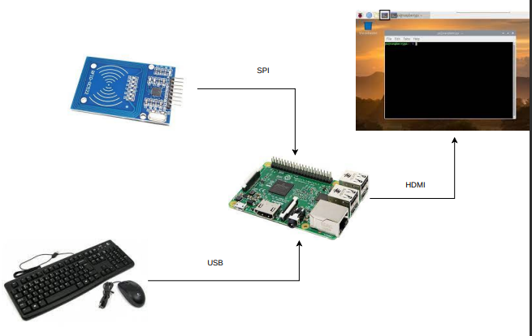
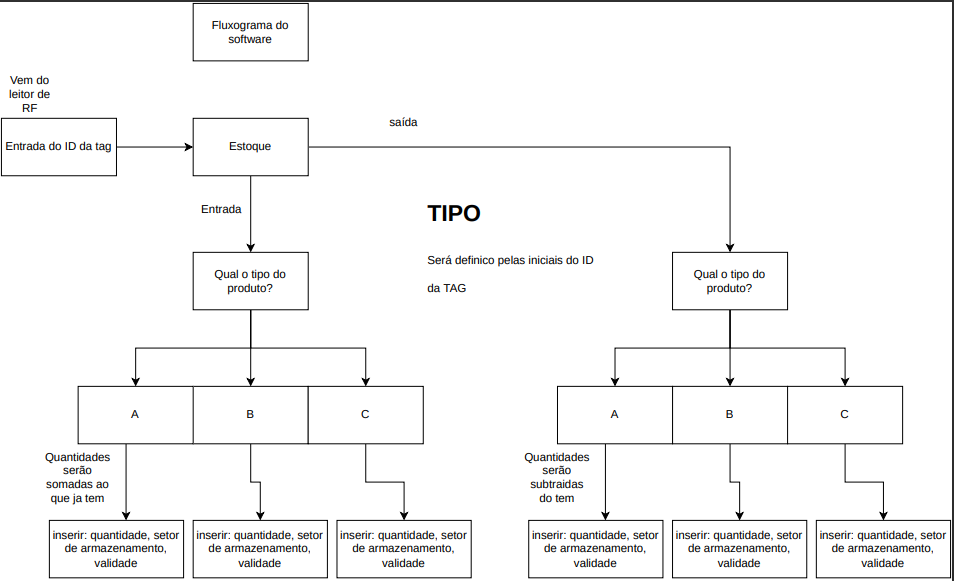

# Controle-De-Estoque
Repostitório Com o proposito de armazenar as ideias e o projeto de controle de estoque usando internet das coisas.

<h1 allign = "center">Diagrama de Hardware</h1>

  

<h1 allign = "center">Diagrama de Software</h1>

  

